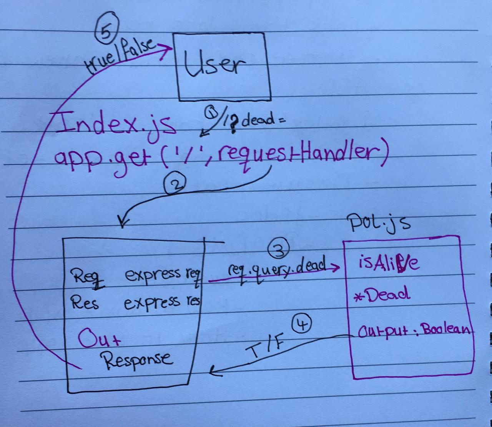

# lab-00

## LAB - Class 00
- Project: Proof of life server
- Author: Sondos Alayyan

## Links and Resources
- [submission PR](https://github.com/sondos-401-advanced-javascript/lab-00/pull/1)

- [travis](https://travis-ci.com/github/sondos-401-advanced-javascript/lab-00)

- [front-end application](https://sondos-lab-00.herokuapp.com/)

## Documentation
[jsdoc](https://sondos-lab-00.herokuapp.com/docs/)

## Modules 
`pos.js`

## Setup
.env requirements (where applicable)

PORT - Number (I used 3030)

How to initialize/run your application (where applicable)
npm start
End-point '/' Return boolean
End-point '/docs' Return jsdoc

How to use your library (where applicable)
Tests
How do you run tests?
unit test: npm test
lint test: npm run lint

UML
